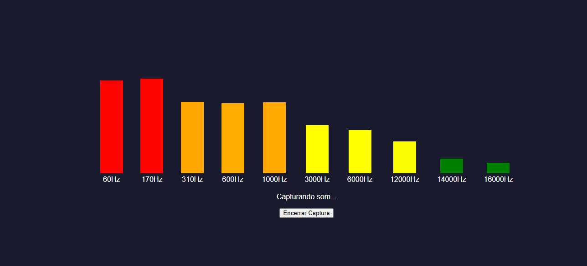

# Analisador de Espectro de Áudio do Sistema

<h2> - Para captar audio de aplicativos compartilhe a tela inteira e marque também compatilhar audio   
- Para captar audio do browser (navegador) compartilhe a aba ou a janela aberta onde o som está tocando </h2>